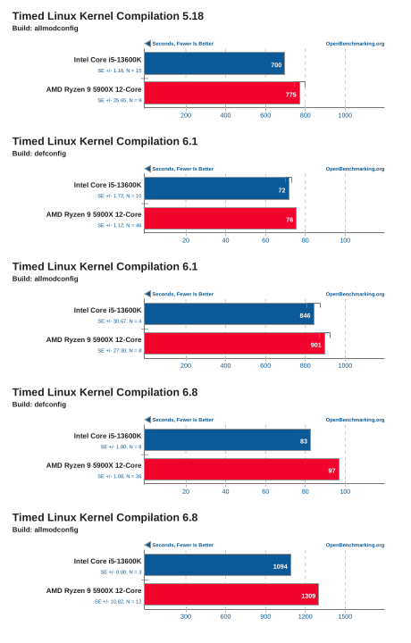
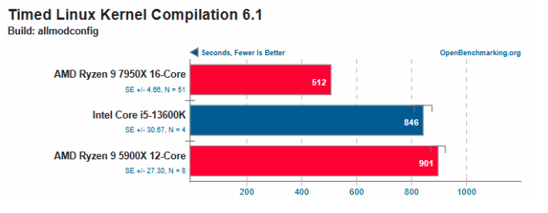

# Sistemas de Computación
## Práctico 1: Rendimiento

**Alumnos:** Cesana Andrés Agustín, Felipe Pillichody, Sol Agustina Nou  
**Profesores:** Jorge Javier Alejandro, Solinas Miguel Ángel  

## Introducción

...

## Marco teórico

### Rendimiento de un Computador

El rendimiento de un computador es la medida de su capacidad para ejecutar tareas de manera eficiente. Se evalúa en función de diversos factores, como la velocidad del procesador, la cantidad y velocidad de la memoria RAM, la capacidad del sistema de almacenamiento y la eficiencia del sistema operativo en la gestión de recursos. También depende de la arquitectura del hardware y la optimización del software. Una mayor capacidad de procesamiento permite ejecutar aplicaciones más complejas y en menor tiempo, lo que mejora la experiencia del usuario y la productividad del sistema.

### Benchmark

Los benchmarks son programas diseñados para monitorear y medir el rendimiento de un sistema de cómputo. Estos programas ejecutan pruebas específicas que evalúan el desempeño de distintos componentes del hardware y software, permitiendo comparaciones objetivas entre sistemas con diferentes configuraciones. Existen distintos tipos de benchmarks que analizan aspectos como la velocidad de procesamiento, el rendimiento gráfico, la velocidad de acceso a disco y el rendimiento en tareas específicas, como edición de video o procesamiento de datos. Los resultados obtenidos ayudan a los usuarios y profesionales a tomar decisiones informadas sobre mejoras y actualizaciones de hardware o software.

### Time Profiling

El time profiling es una técnica utilizada en la evaluación del rendimiento de un sistema o aplicación para determinar cuánto tiempo tarda en ejecutarse cada parte del código. Se emplea en el desarrollo de software para identificar cuellos de botella y optimizar la eficiencia del programa. Esta técnica mide el tiempo de ejecución de funciones específicas, lo que permite detectar procesos que consumen demasiados recursos y mejorar su implementación. Las herramientas de time profiling son fundamentales en la optimización de software, ya que permiten desarrollar aplicaciones más rápidas y eficientes, reduciendo el tiempo de respuesta del sistema y mejorando la experiencia del usuario.

## Desarrollo

A continuación, haremos una lista de las tareas que realizamos cada uno con su computadora diariamente y cuáles podrían llegar a medir mejor las tareas que ustedes realizan a diario.

| Tarea | Benchmark |
|--------|-------------|
| Tareas de oficina que requieren procesamiento de texto y hojas de cálculo (Microsoft Office, Google Workspace) | PCMark 10 |
| Jugar videojuegos | 3DMark, GFXBench |
| Reproducción de vídeos, películas | SpyderX, UL Procyon Video Playback |
| Realizar videollamadas | Zoom Test Meeting Tool, Teams Performance Test |
| Utilizar IDEs | Cinebench R23, CrystalDiskMark |
| Modelar usando programas de simulación (Proteus, MultiSIM) | PassMark (CPU y RAM) |
| Navegación web (Google Chrome, Mozilla Firefox) | Basemark Web 3.0 |
| Redes sociales | JetStream 2, Speedometer 2.0 |

En detalle, este es el funcionamiento de estos distintos benchmark:

- **PCMark 10**: Mide el rendimiento general del sistema, evaluando tareas cotidianas como navegación web, productividad (ofimática) y uso multimedia.
- **3DMark**: Ejecuta pruebas de gráficos 3D para medir la capacidad de la GPU.
- **GFXBench**: Realiza pruebas de rendimiento gráfico en 2D y 3D.
- **SpyderX**: Analiza la precisión de color de la pantalla.
- **UL Procyon Video Playback**: Mide el rendimiento de la reproducción de video.
- **Zoom Test Meeting Tool** y **Teams Performance Test**: Simulan videollamadas para evaluar el rendimiento del sistema.
- **Cinebench R23**: Test de renderizado 3D usando Cinema 4D.
- **CrystalDiskMark**: Evalúa la velocidad de lectura y escritura de discos duros y SSDs.
- **PassMark (CPU y RAM)**: Pruebas de cálculo y acceso a memoria.
- **Basemark Web 3.0**: Evalúa el rendimiento del navegador en aplicaciones web modernas.
- **JetStream 2**: Mide la eficiencia en la ejecución de aplicaciones JavaScript.
- **Speedometer 2.0**: Evalúa la rapidez del navegador en interfaces dinámicas.

A continuación, nos interesa conocer el rendimiento de los siguientes procesadores en la compilación del kernel de Linux:

- **Intel Core i5-13600K**
- **AMD Ryzen 9 5900X 12-Core**

La página OpenBenchmarking proporciona comparaciones detalladas del rendimiento de varios procesadores, incluidos los solicitados. Para evaluar el desempeño, se utilizan dos configuraciones de compilación: **allmodconfig** y **defconfig**.

- **allmodconfig**: Habilita todas las opciones y módulos del kernel, generando una carga de compilación más exigente.
- **defconfig**: Utiliza la configuración predeterminada, resultando en una compilación más liviana.

### Comparación de rendimiento en distintos escenarios:

## Comparación de rendimiento en distintos escenarios:

El rendimiento se calcula como:

$$
\text{Rendimiento} = \frac{1}{\text{Tiempo de compilación}}
$$

| Configuración | Intel Core i5-13600K (Tiempo en s) | Intel Core i5-13600K (Comp/s) | AMD Ryzen 9 5900X (Tiempo en s) | AMD Ryzen 9 5900X (Comp/s) | Diferencia |
|--------------|------------------|------------------|------------------|------------------|------------|
| Kernel 5.18 (allmodconfig) | 700 | 0.001431 | 775 | 0.001291 | +10% |
| Kernel 6.1 (defconfig) | 72 | 0.013891 | 76 | 0.013161 | +5% |
| Kernel 6.1 (allmodconfig) | 846 | 0.001181 | 901 | 0.001111 | +6% |
| Kernel 6.8 (defconfig) | 83 | 0.012051 | 97 | 0.010311 | +14% |
| Kernel 6.8 (allmodconfig) | 1094 | 0.0009141 | 1309 | 0.0007641 | +16% |

En todas las pruebas de compilación del Kernel de Linux (5.18, 6.1 y 6.8), el **Intel Core i5-13600K** supera consistentemente al **AMD Ryzen 9 5900X**.

Las diferencias son menores en **defconfig**, que representa configuraciones estándar, pero se amplían en **allmodconfig**, donde el Intel demuestra mayor eficiencia en cargas de compilación pesadas.
